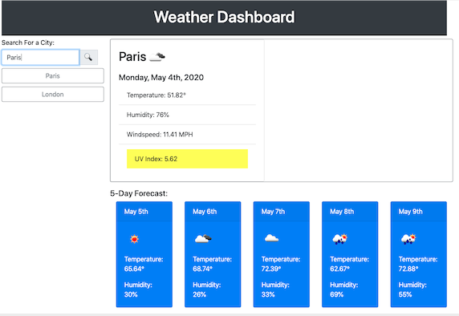

# Weather Dashboard Homework

## Task

In this exercise, we were tasked with building a weather dashboard using the [OpenWeather API](https://openweathermap.org/api). It features dynamically updated HTML and CSS.

## Process

I used OpenWeatherMap's Current Weather API to turn entered city name into lat & lon, then used that in OpenWeatherMap's One-Call API to generate all the data, which populates the different elements on the page. I also used MomentJS's API to populate the date fields.

Here is how the app appears in-browser:

## Status

This assigment is complete.